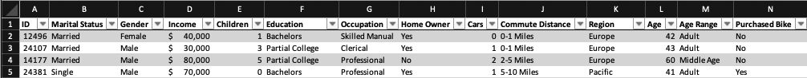
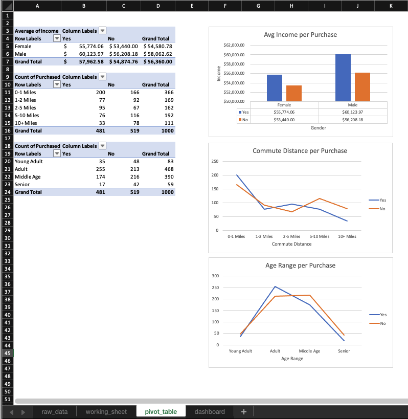
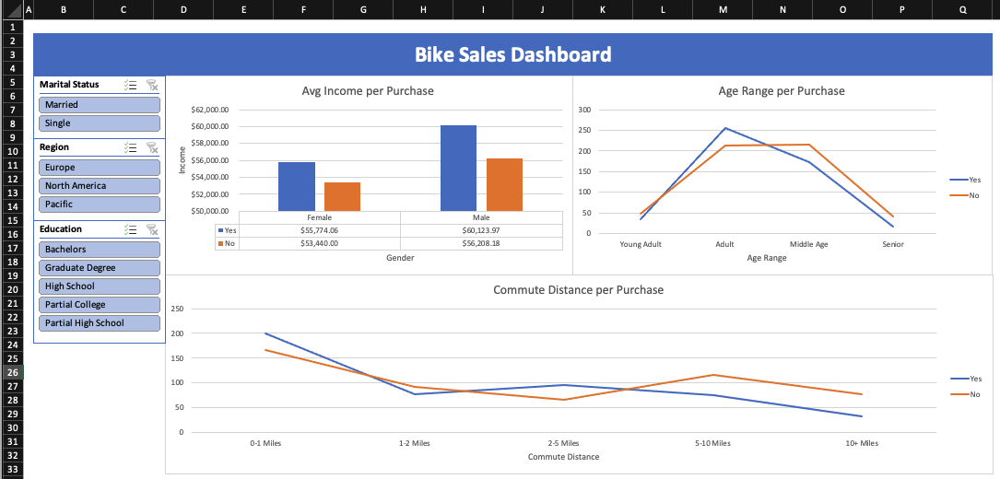

# Coffee Purchases Project

**Tools:** Microsoft Excel  
**Functions Used:** IFS

[Original Data](https://github.com/AlexTheAnalyst/Excel-Tutorial/blob/main/Excel%20Project%20Dataset.xlsx)

**Objective:** Create a sales dashboard based on customer demographics.

## Data Processing
### Input
Ages were grouped into a new column, Age Range.

```
=IFS(L2<30,"Young Adult",L2<45,"Adult",L2<65,"Middle Age",L2>=65,"Senior")
```

### Data Transformation

- used Find & Replace to convert abbreviations to full names
- Children and Age columns were converted to number `0` format

### Data Cleaning
Removed 26 duplicates.

## Tables
Static preview of data.



## Pivot Tables
Pivot tables were used to aggreate data for charts and slicers that would be used in the dashboard.

Tables aggregating Age Range and Commute Distance totals requirec manual sort order.



## Dashboard
Download the [.xlsx file](https://github.com/emixmh/excel-projects/blob/main/bike-purchases/bike-purchases.xlsx) for dynamic version of dashboard.



