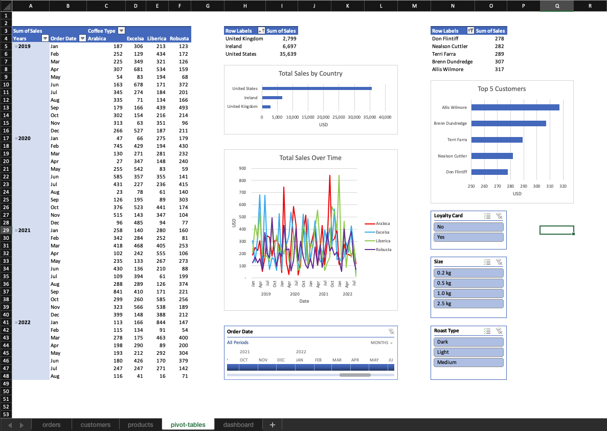

# Coffee Orders Project

**Tools:** Microsoft Excel  
**Functions Used:** XLOOKUP, IF, INDEX MATCH  

[Original Data](https://github.com/mochen862/excel-project-coffee-sales/blob/main/coffeeOrdersData.xlsx)

**Objective:** Create a sales dashboard based on coffee sales.

## Data Processing
### Input
The data was organized as 3 Excel tables: Orders, Customers, and Products

Additional columns were added to Orders as preparation for pivot tables and vizualzations needed for the dashboard.

#### Orders Table
XLOOPUP was used to populate Costomer Name, Email, Country, and Loyalty Card columns. Customer ID was used as the foreign key.

```
=XLOOKUP([@[Customer ID]],Customers[Customer ID],Customers[Customer Name])
```

Some emails were null values and populated as 0 (zero). IF was used to remove zeros and leave null values as blank cells.

```
=IF(XLOOKUP([@[Customer ID]],Customers[Customer ID],Customers[Email])=0,"",XLOOKUP([@[Customer ID]],Customers[Customer ID],Customers[Email]))
```

INDEX MATCH was used to populate Coffee Type, Roast Type, Size, Unit Price, and Sales columns. Product ID was used as the foreign key. XLOOKUP could've also been used to populate these columns.

```
=INDEX(Products[Coffe Type Name], MATCH([@[Product ID]],Products[Product ID],0))
```
#### Products Table
IF was used to  populate full names of Coffee Types and Roast Types.

```
=IF([@[Coffee Type]]="Rob","Robusta",
    IF([@[Coffee Type]]="Exc","Excelsa",
        IF([@[Coffee Type]]="Ara","Arabica",
            IF([@[Coffee Type]]="Lib","Liberica","")
        )
    )
)

=IF([@[Roast Type]]="L","Light",
    IF([@[Roast Type]]="M","Medium",
        IF([@[Roast Type]]="D","Dark","")
    )
)
```

### Data Transformation

- price columns were converted to currency `$   00.00`
- dates were converted to date `yyyy/mm/dd`
- size columns were converted to custom `0.0 kg` format
- quanity was converted to number `0`

### Data Cleaning
No duplicates were found.

## Tables
Static preview of all tables.

**Orders**  


**Customers**  


**Products**  


## Pivot Tables
Pivot tables were used to aggreate data for charts, a timeline, and slicers that would be used in the dashboard.

Sales data was formated as currency without symbol and decimals `000` to avoid visual clutter.



## Dashboard
Download the [.xlsx file](https://github.com/emixmh/excel-projects/blob/main/coffee-orders/coffee-orders.xlsx) for dynamic version of dashboard.


